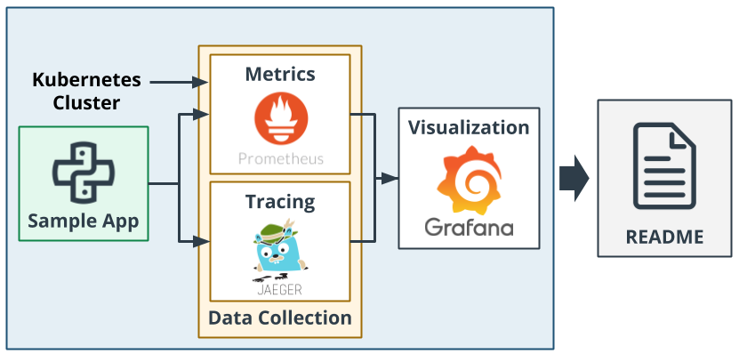
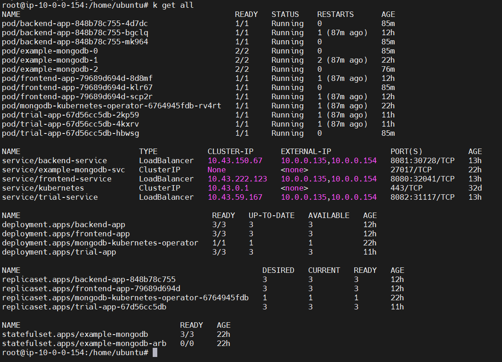
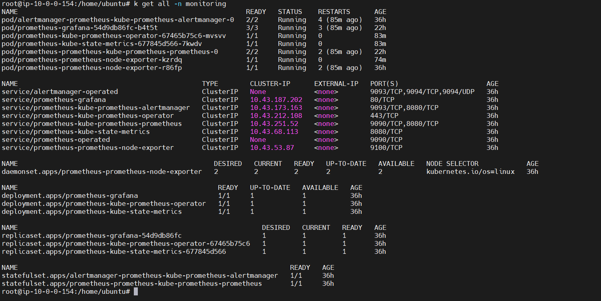
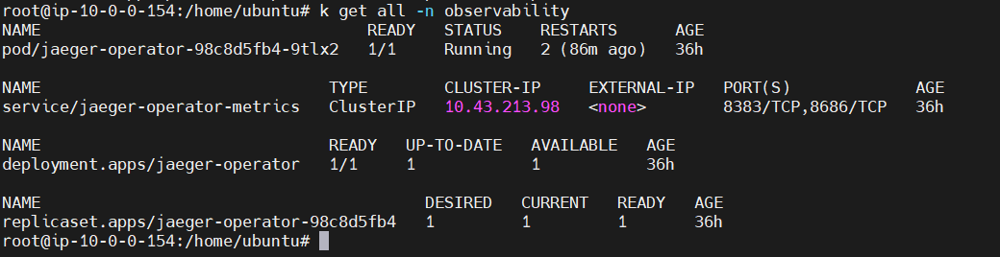
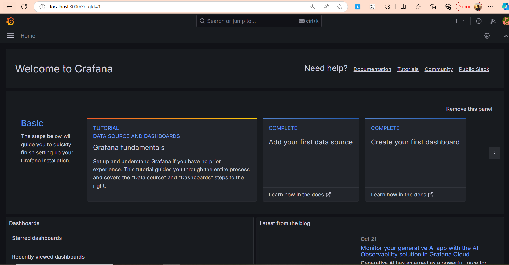
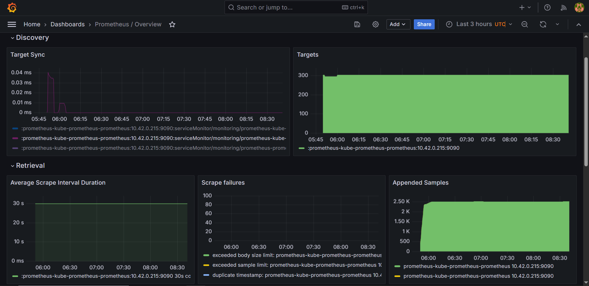
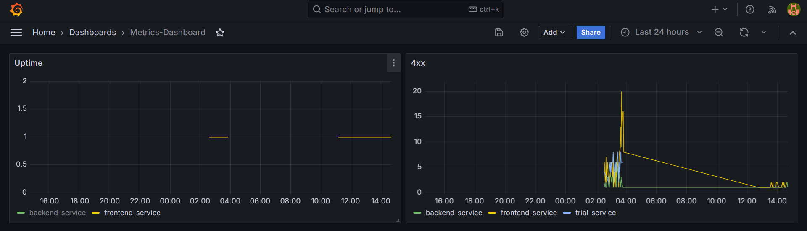
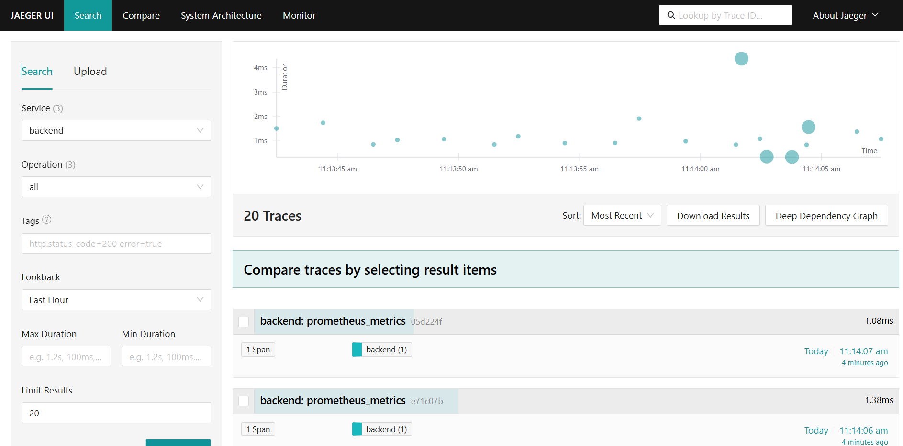
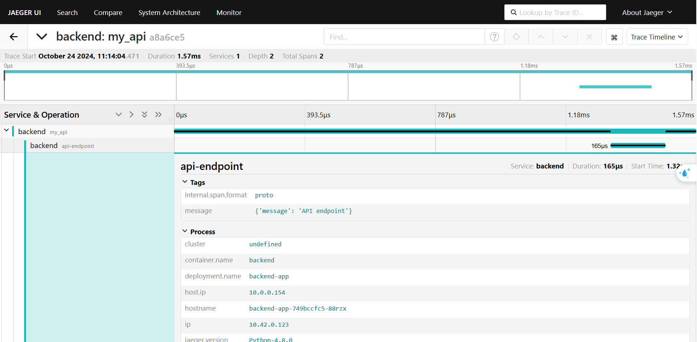
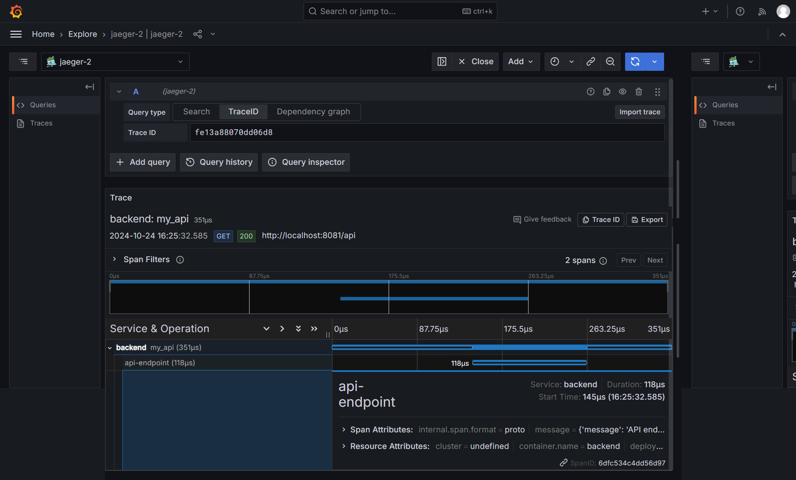

# Cloud Native Observability

In this project, you will create dashboards that use multiple graphs to monitor our sample application that is deployed on a Kubernetes cluster. You will be using Prometheus(opens in a new tab), Jaeger(opens in a new tab), and Grafana(opens in a new tab) in order to monitor, trace and visualize your experience.

## Main Steps

Here are the main steps you'll carry out for this project:

1. Deploy the sample application in your Kubernetes cluster.
2. Use Prometheus to monitor the various metrics of the application.
3. Use Jaeger to perform traces on the application.
4. Use Grafana in order to visualize these metrics in a series of graphs that can be shared with other members on your team.
5. Document your project in a README.

The process is summarized in the diagram below.



## Verify the monitoring installation

### Application



### Monitoring



### Observability




## Setup the Jaeger and Prometheus source

- Expose Grafana to the internet and then setup Prometheus as a data source.



## Create a Basic Dashboard

- Create a dashboard in Grafana that shows Prometheus as a source.



## Describe SLO/SLI

Based on an SLO of *monthly uptime* and *request response time*:

1. 99.99% uptime monthly.
2. Response time of 95% of requests is less than 200 ms.

The SLIs are:

1. Got 99.98% uptime in May.
2. Response time of 96% of the requests is less than 200 ms.

## Creating SLI metrics

| Order | SLIs | Meaning |
|:-----------|:------------:|------------:|
| 1 | Uptime in a period of time | Measure health of the services |
| 2 | Average request response time | Performance of the services |
| 3 | Used CPU and memory | How much resources is used by the services |
| 4 | Count of error responses in a period of time | Identify possible bugs |
| 5 | Average recover time when a service goes down | Identify when incidents start to materially harm the business |

## Create a Dashboard to measure our SLIs

- Create a dashboard to measure the uptime of the frontend and backend services. We will also want to measure 40x and 50x errors. 

- PromQL to create dashboard:
    - Measure 4xx and 5xx errors:
```
sum(flask_http_request_total{status=~"4..|5.."}) by (service)
```
    - Measure uptime for each service:
```
(sum(up{job=~"backend-service|frontend-service"}) by (job)) / (count(up{job=~"backend-service|frontend-service"}) by(job))
```



## Tracing our Flask App

Create a Jaeger span to measure the processes on the backend.

- Dashboard:


- Process details:


## Jaeger in Dashboards

- Now that the trace is running, let's add the metric to our current Grafana dashboard.



## Report Error

- write a trouble ticket for the developers, to explain the errors that you are seeing (400, 500, latency) and to let them know the file that is causing the issue also include a screenshot of the tracer span to demonstrate how we can user a tracer to locate errors easily.

```
TROUBLE TICKET

Name: Sang Le

Date: 10/24/2024 00:55:09 AM

Subject: Many 5xx errors created by Backend Service

Affected Area: API Requests

Severity: High

Description: The error logs is shown with database connection failed.
```

## Creating SLIs and SLOs

- We want to create an SLO guaranteeing that our application has a 99.95% uptime per month. Name four SLIs that you would use to measure the success of this SLO.


| Order | SLOs | SLIs |
|:-----------|:------------:|------------:|
| 1 | 99.95% uptime per month | Uptime is 99.96% |
| 2 | 99.95% response time is under 200ms | Response time under 200ms is 99.95% |
| 3 | The percentage of successful HTTP requests (e.g., 2xx and 3xx status codes) over total requests >= 99.95% | Proportion is 99.97% |
| 4 | The percentage of failed HTTP requests (e.g., 4xx and 5xx status codes) over total requests <= 0.05%  | Proportion is 0.03% |

## Building KPIs for our plan

- Create a list of 2-3 KPIs to accurately measure these metrics as well as a description of why those KPIs were chosen.

2. Uptime KPI

- 99.95% uptime per month
- This KPI measures the availability of your application. It indicates how often your service is operational and accessible to users. A high uptime percentage is critical for user satisfaction and trust.

2. Error Rate KPI

- Less than 1% of requests result in errors
- This KPI measures the percentage of requests that fail or return an error. Keeping the error rate low is crucial for maintaining a reliable service and ensuring users can successfully interact with your application.

3. Throughput KPI

- Handle 1000 requests per minute
- This KPI measures the number of requests your application can handle in a given time frame. Higher throughput indicates that your application can manage more users and traffic, which is important for scalability.

## Final Dashboard

- Create a Dashboard containing graphs that capture all the metrics of your KPIs and adequately representing your SLIs and SLOs.


